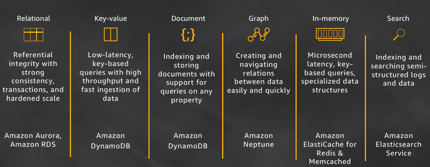

# DynamoDB

 

[This information is correct as of January 5, 2018 but things change rapidly in the cloud and documentation becomes out-of-date extremely quickly.]

To persist state across sessions, a database is necessary.

UPDATE: As of April, 2019 it looks like the Alexa-hosted Skills beta offering allows for S3 as an option:

    http://developer.amazon.com/docs/hosted-skills/build-a-skill-end-to-end-using-an-alexa-hosted-skill.html

DynamoDB is not expensive, but it's not free either.

On the other hand, DynamoDB integration with node.js is relatively painless.

## Integration with node.js

```node
exports.handler = function (event, context, callback) {
    const alexa = Alexa.handler(event, context, callback);
    alexa.appId = appId;
    alexa.dynamoDBTableName = 'YourTableName';
    alexa.registerHandlers( ... );
    alexa.execute();
};
```

That one line of code is all that's needed!

## Runtime

Provision the
[DynamoDB Persistence Adapter](https://github.com/alexa/alexa-skills-kit-sdk-for-nodejs/tree/2.0.x/ask-sdk-dynamodb-persistence-adapter)
as follows:

    $ npm install --save ask-sdk-dynamodb-persistence-adapter

## Performance

If performance becomes an issue, it is always possible to add a caching layer with
[Amazon DynamoDB Accelerator (DAX)](http://aws.amazon.com/dynamodb/dax/).

[Performance generally doesn't seem to be an issue with Alexa, but may become an issue in time.]

## Permissions

Best to allocate 'YourTableName' manually rather than give Create permission.

[The table key must be named `userId`.]

Restrict access as follows:

	{
	  "Version": "2012-10-17",
	  "Statement": [
	    {
	      "Effect": "Allow",
	      "Action": [
	        "dynamodb:PutItem",
	        "dynamodb:GetItem"
	      ],
	      "Resource":["arn:aws:dynamodb:us-east-1:xxxxxxxxxxxx:table/YourTableName"],
	    }
	  ]
	}

## Werner Vogels' blog, "All Things Distributed"

The release announcement:

    http://www.allthingsdistributed.com/2012/01/amazon-dynamodb.html

The White Paper (included here):

    http://www.allthingsdistributed.com/files/amazon-dynamo-sosp2007.pdf

A nice article on the use case for DynamoDB:

    http://www.allthingsdistributed.com/2018/06/purpose-built-databases-in-aws.html



[This image is from the preceding article.]

## Other links

For more on Werner Vogels:

    http://www.se-radio.net/2006/12/episode-40-interview-werner-vogels/

## To Do

- [x] Add a link for the ASK SDK v2 DynamoDB Persistence Adapter
- [ ] Investigate DynamoDB Alerts
- [ ] Investigate Auto-Scaling
